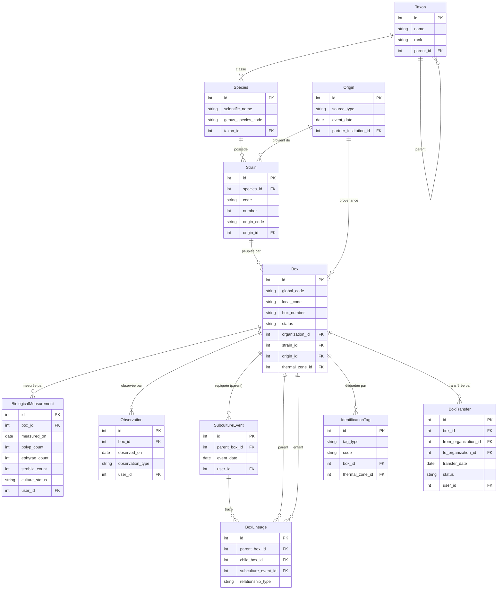
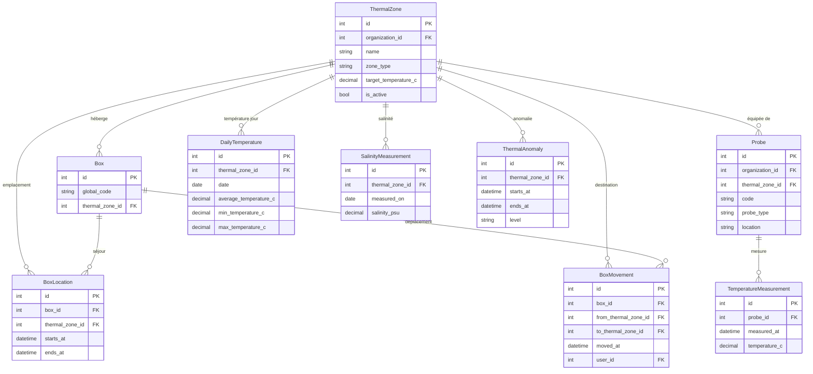
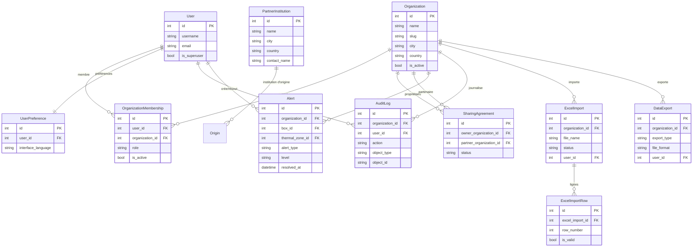

# Schéma de la base de données POLYPBASE (tables réelles)

Diagrammes **entité-relation** générés à partir des modèles Django actuels
(`backend/apps/*/models.py`). Ils reflètent la base **telle qu'implémentée**, et
suivent le découpage des 3 MCD validés (`métier`, `environnement`, `gestion`).

> **Comment visualiser** : ce fichier se rend automatiquement sur **GitHub**.
> Dans **VS Code**, installe l'extension « Markdown Preview Mermaid Support »
> puis ouvre l'aperçu (Ctrl+Shift+V). Pour une image PNG/SVG à coller dans une
> présentation, voir la note en bas.
>
> Les attributs listés sont les principaux (identifiants, champs métier, clés
> étrangères `FK`) ; les colonnes techniques (`created_at`, `notes`…) sont
> omises pour la lisibilité. `PK` = clé primaire, `FK` = clé étrangère.

---

## 1. Domaine MÉTIER — souches, boîtes, suivi biologique

Apps `taxonomy`, `cultures`, `measurements` (relevés biologiques).



---

## 2. Domaine ENVIRONNEMENT — zones thermiques, sondes, températures

Apps `cultures` (zones, emplacements, mouvements), `measurements` (sondes et mesures physiques).



---

## 3. Domaine GESTION — structures, comptes, alertes, imports/exports

Apps `organizations`, `accounts`, `audit`, `exports`.



---

## Liens entre domaines (rappel)

- **`Box`** (métier) appartient à une **`Organization`** (gestion) et vit dans une
  **`ThermalZone`** (environnement).
- **`Alert`** (gestion) peut cibler une **`Box`** ou une **`ThermalZone`**.
- **`Origin`** (métier) référence une **`PartnerInstitution`** (gestion).
- La plupart des tables portent un lien vers **`User`** (gestion) pour la traçabilité.

## Générer une image (PNG/SVG) pour une présentation

Les blocs ```mermaid``` peuvent être convertis en image avec le CLI Mermaid :

```bash
npx -y @mermaid-js/mermaid-cli -i docs/mcd/schema_bdd.md -o docs/mcd/schema_bdd.png
```

(génère un PNG par diagramme). Alternative : copier un bloc dans
<https://mermaid.live> pour l'exporter en PNG/SVG.
